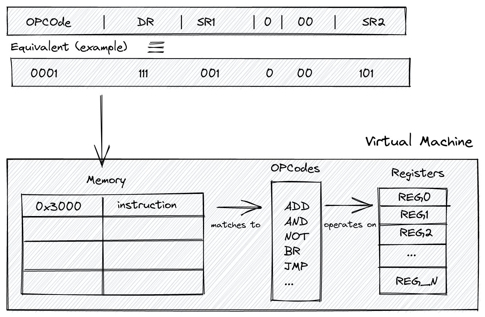
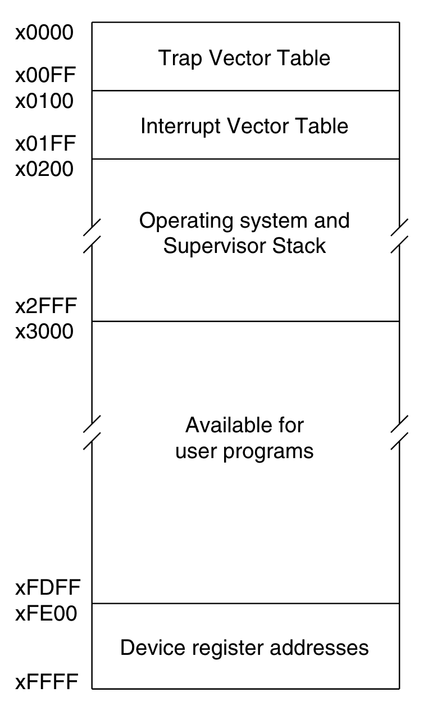

import Tooltip from "../../components/Tooltip.astro";

**From Source Text → Binary Object → Memory → CPU Registers**

> [!abstract]+ **Follow Along with the Code**
> Clone the repository and experiment alongside this guide for a deeper understanding.
> 
> 🔗 **Repository:** <a href="https://github.com/mahantybiplab/LC-3-Rust" target="_blank" rel="noopener noreferrer">mahantybiplab/LC-3-Rust</a>

If you want to understand how execution traces work in modern Zero-Knowledge VMs (zkVMs), you have to start at the bare metal.

In this deep dive, we are going to follow a single program through its entire lifecycle using a custom **Rust-based LC-3 Virtual Machine**. We will watch it transform from human-readable text into a binary object file, get loaded into virtual memory, and finally execute cycle-by-cycle in the CPU's registers. At the end, we'll connect the dots and show how these fundamental CPU cycles form the basis of zkVM execution traces.

> [!info]+ **The Anatomy of Our Virtual Machine**
> A Virtual Machine, in this context, is a software simulation of physical hardware — every wire, register, and memory slot modelled as a data structure. Because it isn't a physical chip, we call it "virtual." From a practical perspective, it lets us safely run LC-3 programs in an isolated software environment.
>
> Our LC-3 VM has exactly **two components**: memory and registers. Here is how they relate to each other and to the instructions that flow through them:
>
> 
>
> A compiled instruction — say, `0001 111 001 0 00 101` — gets loaded into memory at address `x3000`. When the CPU fetches it, the first 4 bits (`0001`) identify the opcode (`ADD`), which is matched against the instruction set. The matched operation then reads from and writes to the registers. That arrow from memory → opcodes → registers is the entire execution loop in one picture.
>
> ---
>
> **1. Memory — The Warehouse**
>
> A flat array of **65,536 slots** (`x0000` to `xFFFF`), each holding a 16-bit value. It stores everything side by side in the same address space: your program's instructions, string data, and variables.
>
> Not all of that space is yours to use, though. The LC-3 reserves specific regions for the operating system, interrupt handling, and device I/O:
>
> 
>
> The regions matter for our VM:
> - **`x0000`–`x00FF`** — Trap Vector Table. Each address holds the starting address of a system call routine (`PUTS`, `GETC`, `HALT`, etc.).
> - **`x0100`–`x01FF`** — Interrupt Vector Table. Addresses for hardware interrupt handlers.
> - **`x0200`–`x2FFF`** — OS and Supervisor Stack. Reserved; your program must not touch this.
> - **`x3000`–`xFDFF`** — **User program space.** This is where our loader writes the `.obj` file, and why `.ORIG x3000` appears at the top of every LC-3 assembly program.
> - **`xFE00`–`xFFFF`** — Device register addresses (memory-mapped I/O). `xFE00` is `KBSR` (keyboard status) and `xFE02` is `KBDR` (keyboard data). Reading these addresses triggers hardware interaction rather than returning ordinary memory values.
>
> > [!question]- Why 65,536 slots? 
> > Because the LC-3 uses 16-bit addresses. A 16-bit address can express $2^{16} = 65,536$ distinct values (`x0000` through `xFFFF`). That means you can point at — at most — 65,536 different memory locations.
> >
> > So the total memory capacity is:
> > $$65,536 \text{ slots} \times 16 \text{ bits} = 1,048,576 \text{ bits} = 128 \text{ KB}$$
>
> * **Why it's needed:** The CPU needs a place to hold far more information than it can keep close to itself. The entire assembled `.obj` file is written here before a single instruction executes.
> * **The catch:** The CPU **cannot do arithmetic directly on values in memory**. It must first copy them into registers, operate there, and write the result back to a register or to a memory address — depending on whether the instruction is an `ADD` (register result) or an `ST`/`STI` (store result back to memory).
>
> ---
>
> **2. Registers — The Workbench**
>
> The CPU's ultra-fast, immediately accessible workspace. Physically, think of registers as a type of memory that's much closer to the CPU than RAM. The LC-3 has **8 general-purpose registers** (`R0`–`R7`), each holding one 16-bit value, plus two special-purpose registers:
>
> * **The Program Counter (`pc`):** Holds the memory address of the *next* instruction to fetch. After every fetch, the CPU increments it by 1 automatically. Branch and jump instructions work by overwriting it — which is how loops and conditionals are possible in hardware.
> * **The Condition Flags (`cond`):** Every time a value is written into a general-purpose register, the CPU records whether that value was **Negative (N)**, **Zero (Z)**, or **Positive (P)**. Branch instructions inspect this flag to decide whether to jump or fall through. Only one flag is live at a time — writing to any register immediately overwrites the previous one.
>
> * **Why it's needed:** All arithmetic and logic in LC-3 happens exclusively between registers. `ADD R4, R2, R3` adds whatever is *currently in* R2 and R3 — not raw values from memory.
> * **The constraint:** With only 8 general-purpose registers, you are always juggling. Needing a 9th value means spilling something back to memory first.
>
> ---
>
> In Rust, the entire physical reality of our LC-3 is two structs:
>
> ```rust
> pub struct Registers {
>     pub r0: u16,   // \
>     pub r1: u16,   //  |
>     pub r2: u16,   //  |
>     pub r3: u16,   //  | general purpose (R0–R7)
>     pub r4: u16,   //  |
>     pub r5: u16,   //  |
>     pub r6: u16,   //  |
>     pub r7: u16,   // /
>     pub pc: u16,   // program counter
>     pub cond: u16, // condition flags: N / Z / P
> }
>
> pub struct VM {
>     pub memory: [u16; 65536], // 64K × 16-bit slots = 64 × 1,024 × 16 bits = 65536 × 16 bits =  1,048,576 bits = 128 K
>     pub registers: Registers,
> }
> ```
>
> Every mechanism in the sections that follow — the loader(the code in `main.rs` that reads the `.obj` file and writes each 16-bit word into `vm.memory` starting at `x3000`), the fetch-decode-execute loop, the ASCII conversion, the branch logic — is ultimately just reads and writes to these two structs.

## The Program Under Study

> [!example]- add.asm
>
> ```asm
> .ORIG x3000
>
> ; =====================================
> ; 1. GET THE FIRST INPUT
> ; =====================================
> LEA R0, PROMPT1       ; Load address of PROMPT1 string into R0
> PUTS                  ; Print the string (TRAP x22)
> GETC                  ; Wait for keypress → result in R0 (TRAP x20)
> OUT                   ; Echo the typed char (TRAP x21)
> LD  R1, ASCII_NEG     ; R1 ← -48 (0xFFD0 in two's complement)
> ADD R2, R0, R1        ; R2 = R0 − 48  (ASCII digit → integer)
> LD  R0, NEWLINE       ; Load '\n' character
> OUT                   ; Print newline
>
> ; =====================================
> ; 2. GET THE SECOND INPUT
> ; =====================================
> LEA R0, PROMPT2
> PUTS
> GETC
> OUT
> ADD R3, R0, R1        ; R3 = R0 − 48  (ASCII digit → integer)
> LD  R0, NEWLINE
> OUT
>
> ; =====================================
> ; 3. DO THE MATH (SHOWING BOTH ADD MODES)
> ; =====================================
> ADD R4, R2, R3        ; MODE 1 — REGISTER:  R4 = R2 + R3
> ADD R4, R4, #2        ; MODE 2 — IMMEDIATE: R4 = R4 + 2 (baked into bits!)
>
> ; =====================================
> ; 4. PRINT THE RESULT
> ; =====================================
> LEA R0, RESULT_STR
> PUTS
> LD  R1, ASCII_POS     ; R1 ← +48 (0x0030)
> ADD R0, R4, R1        ; R0 = R4 + 48  (integer → ASCII char)
> OUT
> LD  R0, NEWLINE
> OUT
> HALT                  ; TRAP x25
>
> ; =====================================
> ; DATA SEGMENT
> ; =====================================
> PROMPT1     .STRINGZ "Enter 1st digit: "
> PROMPT2     .STRINGZ "Enter 2nd digit: "
> RESULT_STR  .STRINGZ "Sum plus 2 is: "
> NEWLINE     .FILL x000A    ; ASCII '\n'
> ASCII_NEG   .FILL xFFD0    ; −48 in two's complement
> ASCII_POS   .FILL x0030    ; +48
> .END
> ```

This program reads two single-digit numbers from the keyboard, converts them from ASCII to integers, adds them using **both** ADD modes (register and immediate), converts the result back to ASCII, and prints it. Walking through its full lifecycle reveals every major mechanism of the LC-3 architecture.

## Phase 1 — The Assembler: Text → Binary

Before the CPU can execute our program, the human-readable text must be converted into a flat, machine-readable binary object (`.obj`) file. This is the <Tooltip text="A program that converts assembly language code into machine code.">assembler's</Tooltip> job. However, it cannot translate the file in a single top-to-bottom read-through. Why? Because instructions at the top of our code (`like LEA R0, PROMPT1`) refer to <Tooltip text="Labels are just names for memory addresses.">labels</Tooltip> that haven't been defined yet. To solve this "forward reference" problem, the assembler processes the source code in exactly two distinct passes.

The assembler translates the `.asm` source into a `.obj` binary in exactly **two passes**.

### Pass 1: Building the Symbol Table

The assembler's only job in Pass 1 is to scan every line, maintain a **Location Counter (LC)** starting at the `.ORIG` address, and record the address of every label it encounters. No machine code is generated yet.

Each instruction and `.FILL` directive advances the LC by 1 word. `.STRINGZ "text"` advances by `len(text) + 1` words (one word per character, plus a null terminator).

> [!abstract]+ **Instruction section (x3000 → x3018, 25 words):**
>
> | Address | Source Line          | Words |
> | ------- | -------------------- | ----- |
> | x3000   | `LEA R0, PROMPT1`    | 1     |
> | x3001   | `PUTS` (= TRAP x22)  | 1     |
> | x3002   | `GETC` (= TRAP x20)  | 1     |
> | x3003   | `OUT` (= TRAP x21)   | 1     |
> | x3004   | `LD R1, ASCII_NEG`   | 1     |
> | x3005   | `ADD R2, R0, R1`     | 1     |
> | x3006   | `LD R0, NEWLINE`     | 1     |
> | x3007   | `OUT`                | 1     |
> | x3008   | `LEA R0, PROMPT2`    | 1     |
> | x3009   | `PUTS`               | 1     |
> | x300A   | `GETC`               | 1     |
> | x300B   | `OUT`                | 1     |
> | x300C   | `ADD R3, R0, R1`     | 1     |
> | x300D   | `LD R0, NEWLINE`     | 1     |
> | x300E   | `OUT`                | 1     |
> | x300F   | `ADD R4, R2, R3`     | 1     |
> | x3010   | `ADD R4, R4, #2`     | 1     |
> | x3011   | `LEA R0, RESULT_STR` | 1     |
> | x3012   | `PUTS`               | 1     |
> | x3013   | `LD R1, ASCII_POS`   | 1     |
> | x3014   | `ADD R0, R4, R1`     | 1     |
> | x3015   | `OUT`                | 1     |
> | x3016   | `LD R0, NEWLINE`     | 1     |
> | x3017   | `OUT`                | 1     |
> | x3018   | `HALT` (= TRAP x25)  | 1     |

**Data section (x3019 onward):**

| Address | Label          | Directive                      | Words (len + null) |
| ------- | -------------- | ------------------------------ | ------------------ |
| x3019   | **PROMPT1**    | `.STRINGZ "Enter 1st digit: "` | 17 + 1 = 18        |
| x302B   | **PROMPT2**    | `.STRINGZ "Enter 2nd digit: "` | 17 + 1 = 18        |
| x303D   | **RESULT_STR** | `.STRINGZ "Sum plus 2 is: "`   | 15 + 1 = 16        |
| x304D   | **NEWLINE**    | `.FILL x000A`                  | 1                  |
| x304E   | **ASCII_NEG**  | `.FILL xFFD0`                  | 1                  |
| x304F   | **ASCII_POS**  | `.FILL x0030`                  | 1                  |

> [!abstract]+ **Hex Math Breakdown: Step-by-Step**
> Here is the column-by-column logic for the jumps in our Data Segment. Remember: in Hex, you carry over only after hitting **15 (F)**.
>
> **1. Adding 18 Words (`x12`)**
> Used to find the address after `PROMPT1` and `PROMPT2`.
>
> ```
>
>   x3019   (Start)
> + x0012   (18 words = 18 = 16+2 = (1×16^1)+(2×16^0) = x0012) 
> ───────
>   x302B
> ```
>
> - **Right column:** `9 + 2 = 11`. In Hex, 11 is **`B`**.
> - **Second column:** `1 + 1 = 2`.
>
> ---
>
> **2. Adding 16 Words (`x10`)**
> Used to find the address after `RESULT_STR`.
>
> ```
>   x303D   (Start)
> + x0010   (16 words = 16 + 0 = (1×16^1) + (0×16^0) = x0010)
> ───────
>   x304D
> ```
>
> - **Right column:** `D + 0 = D`.
> - **Second column:** `3 + 1 = 4`.
>
> ---
>
> **3. Sequential Fills (`+1`)**
> Used for single-word directives like `.FILL`.
>
> ```
> x304D + 1 = x304E   (ASCII_NEG)
> x304E + 1 = x304F   (ASCII_POS)
> x304F + 1 = x3050   (End of Program)
> ```


**Resulting Symbol Table after Pass 1:**

```

┌────────────┬───────────┐
│   Symbol   │  Address  │
├────────────┼───────────┤
│  PROMPT1   │  x3019    │
│  PROMPT2   │  x302B    │
│  RESULT_STR│  x303D    │
│  NEWLINE   │  x304D    │
│  ASCII_NEG │  x304E    │
│  ASCII_POS │  x304F    │
└────────────┴───────────┘
```

Labels are just names for memory addresses. When Pass 2 sees `LD R1, ASCII_NEG`, it doesn't look in the source — it looks up `0x3050` in this table.

> [!info]- **Hexadecimal to Binary and Decimal Conversion**
>
> 1. **Hex to Binary**
>
> - Each hexadecimal digit = **4 binary bits**.
> - Convert each hex digit individually.
>
> 2. **Hex to Decimal**
>
> - Use powers of 16 from right to left:  
>   `16³, 16², 16¹, 16⁰`
>
> **Example: Convert `x300A`**
>
> **Hex:** `x300A`
>
> **Step 1: Hex → Binary**
>
> Convert each digit to 4-bit binary:
>
> | Hex | Binary |
> | --- | ------ |
> | 3   | 0011   |
> | 0   | 0000   |
> | 0   | 0000   |
> | A   | 1010   |
>
> **Binary result:** `0011 0000 0000 1010`
>
> **Step 2: Hex → Decimal**
> Calculate:  
> `3×16³ + 0×16² + 0×16¹ + 10×16⁰`
>
> - 3 × 4096 = 12288
> - 0 × 256 = 0
> - 0 × 16 = 0
> - 10 × 1 = 10
>
> **Decimal result:** **12298**
>
> Use this mapping for fast conversion:  
> 0=0000, 1=0001, ..., 9=1001, A=1010, B=1011, C=1100, D=1101, E=1110, F=1111

### Pass 2: Code Generation

Instead of manually encoding all 25 instructions, let's zoom in on a few critical lines that demonstrate the LC-3's core mechanics—starting with our two ADD modes.

#### <Tooltip text='Encoding is the process of "packing" information into a fixed number of bits. The LC-3 uses a 16-bit instruction word. To tell the CPU to add two registers, we have to flip specific bits in that 16-bit "box" according to an Instruction Format.'>Encoding</Tooltip> `ADD R4, R2, R3` — Register Mode (at x300F)

This is the **register mode** ADD, where both source operands come from registers. Identified by **bit [5] = 0**.

**ADD Register Mode Format:**

```

// Instruction Format 
┌────┬─────┬─────┬───┬────┬─────┐
|0001│ DR  │ SR1 │ 0 │ 00 │ SR2 │
│15:12│11:9│ 8:6 │[5]│4:3 │ 2:0 │
└────┴─────┴─────┴───┴────┴─────┘
```

```

Opcode:    0001         (ADD)
DR:        100          (R4)
SR1:       010          (R2)
bit[5]:    0            (register mode)
bits[4:3]: 00           (unused)
SR2:       011          (R3)

Full word:  0001 100 010 0 00 011
Grouped:   0001 1000 1000 0011
Hex:       0x1883
```

#### Encoding `ADD R4, R4, #2` — Immediate Mode (at x3010)

This is the **immediate mode** ADD. The literal `2` is **baked directly into the instruction word itself**. Identified by **bit [5] = 1**.

**ADD Immediate Mode Format:**

```

┌────┬─────┬─────┬───┬───────────┐
│0001│ DR  │ SR1 │ 1 │   imm5    │
│15:12│11:9│ 8:6 │[5]│   4:0     │
└────┴─────┴─────┴───┴───────────┘
```

```

Opcode:    0001         (ADD)
DR:        100          (R4)
SR1:       100          (R4)
bit[5]:    1            (immediate mode ← this single bit changes everything)
imm5:      00010        (+2, a 5-bit signed value)

Full word:  0001 100 100 1 00010
Grouped:   0001 1001 0010 0010
Hex:       0x1922
```

**The critical contrast between both encodings:**

```
Instruction      │ Hex    │ Binary
─────────────────┼────────┼──────────────────
ADD R4, R2, R3   │ 0x1883 │ 0001 1000 1000 0011
ADD R4, R4, #2   │ 0x1922 │ 0001 1001 0010 0010
                                    ↑
                              bit[5] flips 0 → 1
                              CPU reads bits[4:0] as imm5=2
                              instead of treating bits[2:0] as SR2
```

The trade-off: immediate mode saves a register load, but the literal is capped at **5 bits** — a range of −16 to +15.

#### Encoding `LD R1, ASCII_NEG` — PCoffset9 Computation (at x3004)

`LD` loads a value from a memory address computed relative to the **already-incremented PC**. PC is already-incremented because in the LC-3 fetch–execute cycle, the CPU increments the PC during the fetch stage so it already points to the next instruction before the current instruction (like LD) is executed.

```
// In LC-3:
Effective Address = PC (after increment) + PCoffset
```
```

PCoffset9 = Target − (Instruction Address + 1)
           = 0x304E − (0x3004 + 1)
           = 0x304E − 0x3005
           = 0x0049  =  73  =  0b0 0100 1001
```

**LD Format:**

```

┌────┬─────┬─────────────────────┐
│0010│ DR  │     PCoffset9       │
│15:12│11:9│       8:0           │
└────┴─────┴─────────────────────┘
```

```

Opcode:    0010         (LD)
DR:        001          (R1)
Offset:    001001001    (73 = 0x49)

Full word: 0010 001 001001001
Grouped:   0010 0010 0100 1001
Hex:       0x2249
```

#### The ASCII Conversion Trick — Two's Complement Addition

`ADD R2, R0, R1` (where R1 = `0xFFD0 = −48`) converts an ASCII digit to an integer. There is no special "convert" instruction — it's pure two's complement arithmetic.

If the user typed `'5'` (ASCII 53):

```

R0 = 0x0035  (53)
R1 = 0xFFD0  (−48)

0x0035 + 0xFFD0 = 0x10005
→ truncated to 16 bits = 0x0005 = 5  ✓
```

> [!abstract]- Why does `0xFFD0` equal `-48`?
>
> **First — why does MSB = `1` mean negative?**
>
> In a normal unsigned 16-bit number, every bit position carries a positive weight:
> $$2^{15},\ 2^{14},\ 2^{13},\ \ldots,\ 2^1,\ 2^0$$
> So `1111 1111 1111 1111` = $65535$. No negatives possible.
>
> Two's complement fixes this with one architectural decision: **make the MSB's weight negative**.
> $$\mathbf{-2^{15}},\ 2^{14},\ 2^{13},\ \ldots,\ 2^1,\ 2^0$$
> That's it. Every bit except the MSB keeps its positive weight. The MSB alone contributes $-32768$. So any bit pattern with MSB = `1` starts at $-32768$ and adds the remaining bits back up — which is always a negative result.
>
> ---
>
> **Now, working out `xFFD0` step by step**
>
> **Step 1 — Hex to Binary**
> Convert each hex digit to 4 bits:
>
> | Hex | Binary |
> | --- | ------ |
> | `F` | `1111` |
> | `F` | `1111` |
> | `D` | `1101` |
> | `0` | `0000` |
>
> Full 16-bit string: `1111 1111 1101 0000`
>
> **Step 2 — Check the Sign Bit**
> The MSB is `1`. As established above, this means the number is negative and its MSB alone is already contributing $-2^{15} = -32768$. We now need to find the exact magnitude using the **Flip and Add 1** shortcut — which is faster than computing the full weighted sum.
>
> **Step 3 — Flip All the Bits (NOT)**
> Invert every bit — `1` becomes `0`, `0` becomes `1`:
>
> ```
>
> Before:  1111 1111 1101 0000
> After:   0000 0000 0010 1111
> ```
>
> **Step 4 — Add 1**
>
> ```
>
> 0000 0000 0010 1111
> +                   1
> = 0000 0000 0011 0000
> ```
>
> The trailing `1111 + 1` ripple-carries left, turning all four bits to `0` and setting the next bit up.
>
> **Step 5 — Binary to Decimal**
> Only two bits are set in `0000 0000 0011 0000`:
> $$2^5 + 2^4 = 32 + 16 = 48$$
>
> **Result**
> The magnitude is `48`. The original MSB was `1` (negative), so:
> $$\texttt{xFFD0} = -48$$
>
> ---
>
> > [!tip] Two ways to verify this
> > **1. Direct weighted sum** — use the $-2^{15}$ rule literally:
> > $$-32768 + 16384 + 8192 + 4096 + 2048 + 1024 + 512 + 256 + 128 + 64 + 16 = -48\ ✓$$
> >
> > **2. Zero-sum check** — add `xFFD0` and `+48`. In two's complement they must cancel to zero (carry discarded):
> > $$\texttt{1111\ 1111\ 1101\ 0000} + \texttt{0000\ 0000\ 0011\ 0000} = \texttt{1\ 0000\ 0000\ 0000\ 0000}$$
> > Drop the carry → `0000 0000 0000 0000` ✓

The reverse (integer → ASCII) via `ADD R0, R4, R1` where R1 = `0x0030` (+48):

```

R4 = 0x000A  (10, the final sum)
R1 = 0x0030  (+48)

0x000A + 0x0030 = 0x003A  =  ASCII ':'
```

_(Note: this program assumes single-digit inputs that sum to ≤ 9 before the +2. For sum = 7+1+2 = 10, the output is `:` — a known limitation for teaching purposes.)_

> [!warning]- Limitation — What happens when the sum exceeds 9?
>
> The program converts a digit to ASCII by adding `0x0030` (+48) to the raw integer result. This works perfectly as long as the sum is a **single digit (0–9)**:
>
> | Sum | + 0x0030 | ASCII |
> | --- | -------- | ----- |
> | `0` | `0x0030` | `'0'` |
> | `5` | `0x0035` | `'5'` |
> | `9` | `0x0039` | `'9'` |
>
> But ASCII digits only occupy the range `0x0030–0x0039`. The moment the sum hits **10 or above**, you spill out of that range entirely:
>
> | Sum  | + 0x0030 | ASCII | Result   |
> | ---- | -------- | ----- | -------- |
> | `10` | `0x003A` | `':'` | ❌ wrong |
> | `11` | `0x003B` | `';'` | ❌ wrong |
> | `12` | `0x003C` | `'<'` | ❌ wrong |
>
> For the inputs `7 + 1 + 2 = 10` in this program, the output is `':'` instead of `'10'` — because the program has no logic to handle multi-digit results. Producing `'10'` would require splitting the integer into its tens digit (`1`) and units digit (`0`) and converting each separately, which involves division — an operation LC-3 has no native instruction for.
>
> This is a deliberate simplification for teaching purposes. The program correctly demonstrates the ASCII ↔ integer conversion mechanic; it just assumes inputs small enough that their sum stays within `0–9`.

### The `.obj` File Structure

The assembled output is a flat sequence of 16-bit **big-endian** words. The first word is always the **Origin Address** — the only metadata the format contains.

```

File Offset │ Bytes (hex) │  Word (hex) │ Meaning
────────────┼─────────────┼─────────────┼──────────────────────────────
  0x00–0x01 │   30  00    │   0x3000    │ Origin address
  0x02–0x03 │   E0  19    │   0xE019    │ LEA R0, PROMPT1
  0x04–0x05 │   F0  22    │   0xF022    │ PUTS (TRAP x22)
  0x06–0x07 │   F0  20    │   0xF020    │ GETC (TRAP x20)
  0x08–0x09 │   F0  21    │   0xF021    │ OUT  (TRAP x21)
  0x0A–0x0B │   22  4B    │   0x224B    │ LD R1, ASCII_NEG
  0x0C–0x0D │   14  01    │   0x1401    │ ADD R2, R0, R1
  ...       │   ...       │   ...       │ ...
  (x300F)   │   18  83    │   0x1883    │ ADD R4, R2, R3  ← register mode
  (x3010)   │   19  22    │   0x1922    │ ADD R4, R4, #2  ← immediate mode
  ...       │   ...       │   ...       │ ...
  (x304E)   │   FF  D0    │   0xFFD0    │ ASCII_NEG = −48
  (x304F)   │   00  30    │   0x0030    │ ASCII_POS = +48
```

**Big-endian** means the Most Significant Byte is written first. For `0x224B`, byte `0x22` hits the disk before `0x4B`.

## Phase 2 — The Loader: Disk → VM Memory

When `cargo run -- examples/add.obj` runs, the loader in `main.rs` executes:

```rust
let base_address = f.read_u16::<BigEndian>().expect("error"); // reads 0x3000

let mut address = base_address as usize; // = 12288

loop {
    match f.read_u16::<BigEndian>() {
        Ok(instruction) => {
            vm.write_memory(address, instruction); // memory[address] = word
            address += 1;                          // +1, not +2 — each slot is already u16
        }
        Err(e) if e.kind() == UnexpectedEof => break,
        Err(e) => panic!("failed: {}", e),
    }
}
```

`vm.memory` is `[u16; 65535]` — each element holds a full 16-bit word, so the address index increments by 1, not 2.

**Memory state at key addresses after loading:**

```

Address  │  Value (hex) │  Binary              │  Meaning
─────────┼──────────────┼──────────────────────┼───────────────────────
 0x3000  │   0xE018     │ 1110 0000 0001 1000  │ LEA R0, PROMPT1
 0x3004  │   0x2249     │ 0010 0010 0100 1001  │ LD R1, ASCII_NEG
 0x3005  │   0x1401     │ 0001 0100 0000 0001  │ ADD R2, R0, R1
 0x300F  │   0x1883     │ 0001 1000 1000 0011  │ ADD R4, R2, R3
 0x3010  │   0x1922     │ 0001 1001 0010 0010  │ ADD R4, R4, #2
 0x304E  │   0xFFD0     │ 1111 1111 1101 0000  │ −48  (ASCII_NEG)
 0x304F  │   0x0030     │ 0000 0000 0011 0000  │ +48  (ASCII_POS)
```

> [!abstract]+ **Memory Map: Post-Load Layout**
> 
> ```text
>  Address     Memory Contents        Segment
>           .───────────────────. 
>           |    (Empty / OS)   | 
>           |───────────────────| 
>  x3000    |  0xE018 (LEA)     |  ◄── PC Start
>  x3001    |  0xF022 (PUTS)    |   ▲
>    ...    |       ...         |   │  INSTRUCTIONS
>  x3017    |  0xF021 (OUT)     |   │  (25 words)
>  x3018    |  0xF025 (HALT)    |   ▼
>           |───────────────────|  ─── BOUNDARY
>  x3019    |  'E' (0x0045)     |   ▲
>  x301A    |  'n' (0x006E)     |   │
>    ...    |       ...         |   │  DATA / STRINGS
>  x304D    |  0x000A ('\n')    |   │  (55 words)
>  x304E    |  0xFFD0 (-48)     |   │
>  x304F    |  0x0030 (+48)     |   ▼
>           |───────────────────| 
>           |    (Available)    |
>           '───────────────────'
> ```

**PC Initialization:** `Registers::new()` hardcodes `pc: PC_START` where `PC_START = 0x3000`. The loader reads the origin word only to know _where to write_ the program into memory. The PC is initialized independently by convention — they happen to agree on `0x3000`.

## Phase 3 — Execution: The CPU's Fetch-Decode-Execute Loop

```rust
pub fn execute_program(vm: &mut VM) {
    while vm.registers.pc < MEMORY_SIZE as u16 {
        let instruction = vm.read_memory(vm.registers.pc); // FETCH
        vm.registers.pc += 1;                              // INCREMENT PC
        instruction::execute_instruction(instruction, vm)  // DECODE + EXECUTE
    }
}
```

We trace four cycles that capture every key concept in this program.

### CPU Cycle 5 — `LD R1, ASCII_NEG` at x3004


> [!info]+ **Bitwise Shifting: `<<` (Left) and `>>` (Right)**
> Bitwise shifts move an entire sequence of bits left or right by a specified number of spaces. Think of it like a conveyor belt: bits are pushed in one direction, causing bits on one edge to fall off into the void, while empty spaces on the other edge are filled with new bits.
> 
> **1. Left Shift (`<<`): The Multiplier**
> Shifting left pushes all bits to the left. The bits on the far left fall off and disappear, while new `0`s are fed into the right side.
> 
> Mathematically, shifting left by $n$ spaces is the same as **multiplying by $2^n$**.
> 
> **Example: `3 << 2`** (Shift the number $3$ left by $2$ spaces)
> * **Original:** `0000 0011` ($3$)
> * **Shift 1:** `0000 0110` ($6$)
> * **Shift 2:** `0000 1100` ($12$)
> 
> ---
> 
> **2. Right Shift (`>>`): The Divider**
> Shifting right pushes all bits to the right. The bits on the far right (the smallest values) fall off and are permanently lost. For unsigned integers, new `0`s are fed into the left side.
> 
> Mathematically, shifting right by $n$ spaces is the same as **integer division by $2^n$** (meaning remainders are dropped).
> 
> **Example: `24 >> 3`** (Shift the number $24$ right by $3$ spaces)
> * **Original:** `0001 1000` ($24$)
> * **Shift 1:** `0000 1100` ($12$)
> * **Shift 2:** `0000 0110` ($6$)
> * **Shift 3:** `0000 0011` ($3$)
> 
> ---
> 
> **🛠️ Why we use them in the VM?**
>
> In computer architecture, you rarely use shifts for math; you use them to **align data**. 
> 
> In your LC-3 VM, a 16-bit instruction contains multiple "fields" packed tightly together. To read the Destination Register (DR) sitting in bits [11:9], you have to move it to the end of the line before you can isolate it:
> 1. **Shift it:** `instruction >> 9` pushes the 16-bit word right by 9 spaces. The DR bits slide all the way down into the [2:0] slots.
> 2. **Mask it:** Now that the DR bits are at the end, you use `& 0x7` to chop off all the higher bits, leaving you with just the exact Register ID!


#### Fetch

```

PC before:    0x3004
instruction:  vm.memory[0x3004] = 0x2249
PC after:     0x3005
```

#### Decode

```

0x2249 = 0010 0010 0100 1001
>> 12  = 0000 0000 0000 0010  = 2  →  OpCode::LD
```

#### Execute — `ld(0x2249, vm)`

```

1. Extract DR:
   0x2249 >> 9 = 17
   17 & 0x7    = 1  →  dr = R1 ✓

2. Extract PCoffset9:
   0x2249 & 0x1FF = 0x049 = 73
   sign_extend(73, 9): bit[8] of 73 = 0 → positive, no extension
   pc_offset = 73

3. Effective address:
   mem = 73 + 0x3005 = 0x304E

4. Read memory:
   vm.memory[0x304E] = 0xFFD0  (−48)

5. Write to register:
   R1 = 0xFFD0

6. Condition flags:
   0xFFD0 >> 15 = 1 → MSB is 1 → negative
   COND = NEG = (1 << 2) = 0x0004
```

**State after Cycle 5:**

```

R1   = 0xFFD0  (−48)
COND = 0x0004  (NEG)
PC   = 0x3005
```

> [!info]+ **The Hardware's Helpers: Sign Extension & Condition Flags**
> To understand how a VM bridges the gap between small instruction components and 16-bit math, we have to look at two specific mechanisms: **Sign Extension** and the **Condition (COND) Flags**.
> 
> **1. Sign Extension (`sign_extend`)**
>
> **The Problem:** 
> The LC-3 processor only knows how to do math on full 16-bit numbers. However, instructions often contain smaller numbers. For example, an `ADD` instruction in Immediate Mode only has **5 bits** for the number. A `LD` offset only has **9 bits**. How do we add a 5-bit number to a 16-bit register?
> 
> **The Wrong Way (Zero Padding):**
> Imagine we want to add $-2$. In 5-bit Two's Complement, $-2$ is `11110`. 
> If we just fill the remaining 11 bits with zeros so the ALU can process it, we get `0000 0000 0001 1110`. In 16-bit math, that is **$+30$**. We completely destroyed the value!
> 
> **The Right Way (Sign Extension):**
> To keep the mathematical value identical while making the binary wider, we must look at the **Most Significant Bit (MSB)** of the small number (the sign bit) and copy it to fill all the new empty space.
> * If MSB is `0` (Positive): Pad with `0`s.
> * If MSB is `1` (Negative): Pad with `1`s.
> 
> *Example of Sign-Extending our 5-bit $-2$:*
> `11110` $\rightarrow$ copy the leading `1` $\rightarrow$ `1111 1111 1111 1110` (which is properly $-2$ in 16-bit math).
> 
>
>`sign_extend` is called on every PCoffset9 and imm5 before arithmetic:
>
>```rust
>fn sign_extend(mut x: u16, bit_count: u8) -> u16 {
>    if (x >> (bit_count - 1)) & 1 != 0 {
>        x |= 0xFFFF << bit_count;
>    }
>    x
> }
> ```
>
> For a backward-jumping `PCoffset9` like `0b1_1111_1100` (= −4 in 9-bit space):
>
> ```
> Test sign bit: (0b1_1111_1100 >> 8) & 1 = 1  → negative!
>
> 0xFFFF << 9   = 1111 1110 0000 0000
> x (9-bit)     = 0000 0001 1111 1100
>
> x |= result:
>   0000 0001 1111 1100
> | 1111 1110 0000 0000
> = 1111 1111 1111 1100  = 0xFFFC = −4 in i16  ✓
> ```
> Without this, a backward branch offset of −4 would be misread as +508, sending the PC into garbage memory.
>
> ---
> 
> **2. Condition Flags (`COND`)**
>
> **The Problem:**
> A CPU has no memory of the past; it just blindly executes the instruction currently in the `PC`. So, how do you write an `if` statement or a `while` loop? The CPU needs a way to evaluate a value and make a routing decision.
> 
> **The Solution:**
> The Condition Flags act as a tiny, automatic "sticky note" that the CPU updates every time it writes data into a register. The LC-3 has three flags: **N** (Negative), **Z** (Zero), and **P** (Positive).
> 
> **How it works:**
> 1.  **The Trigger:** Any instruction that writes to a register (`ADD`, `AND`, `NOT`, `LD`, `LDI`, `LDR`, `LEA`) triggers the flag update.
> 2.  **The Evaluation:** The CPU looks at the raw 16-bit binary just before it goes into the register.
>     * If the MSB is `1`, it sets the **N** flag.
>     * If all 16 bits are `0`, it sets the **Z** flag.
>     * Otherwise, it sets the **P** flag.
> 3.  **The Consumer:** Branch instructions (`BR`) do absolutely no math. They simply look at the "sticky note." If you write `BRz` (Branch if Zero), the CPU checks the **Z** flag. If it's set, the PC jumps; if not, the PC just moves to the next line.


### CPU Cycle 6 — `ADD R2, R0, R1` at x3005 _(ASCII → Integer)_

Assume the user typed `'5'`, so GETC placed `R0 = 0x0035` (= 53).

#### Fetch

```

PC before:    0x3005
instruction:  vm.memory[0x3005] = 0x1401
PC after:     0x3006
```

#### Decode

```

0x1401 = 0001 0100 0000 0001
>> 12  = 0000 0000 0000 0001  = 1  →  OpCode::ADD
```

#### Execute — `add(0x1401, vm)`

```

0x1401 = 0001 0100 0000 0001

DR      = bits[11:9] = 010 = R2
SR1     = bits[8:6]  = 000 = R0
bit[5]               = 0   → REGISTER MODE
SR2     = bits[2:0]  = 001 = R1

val  = R0 + R1
             = 0x0035 + 0xFFD0
             = 0x10005
             → truncated to u16 = 0x0005 = 5

R2   = 0x0005
COND = POS = 0x0001
```

### CPU Cycle 16 — `ADD R4, R2, R3` at x300F _(Register Mode)_

Assume the user typed `'3'` for the second input, so after the same ASCII conversion, `R3 = 3`.

#### Fetch

```

PC before:    0x300F
instruction:  vm.memory[0x300F] = 0x1883
PC after:     0x3010
```

#### Decode

```
0x1883 >> 12 = 1  →  OpCode::ADD
```

#### Execute — `add(0x1883, vm)`

```

0x1883 = 0001 1000 1000 0011

DR      = bits[11:9] = 100 = R4
SR1     = bits[8:6]  = 010 = R2
bit[5]               = 0   → REGISTER MODE
SR2     = bits[2:0]  = 011 = R3

val = R2 + R3 = 5 + 3 = 8

R4   = 0x0008
COND = POS = 0x0001
```

### CPU Cycle 17 — `ADD R4, R4, #2` at x3010 _(Immediate Mode)_

The literal `2` is encoded directly inside the instruction word.

#### Fetch

```

PC before:    0x3010
instruction:  vm.memory[0x3010] = 0x1922
PC after:     0x3011
```

#### Decode

```
0x1922 >> 12 = 1  →  OpCode::ADD
```

#### Execute — `add(0x1922, vm)`

```

0x1922 = 0001 1001 0010 0010

DR      = bits[11:9] = 100 = R4
SR1     = bits[8:6]  = 100 = R4
bit[5]               = 1   → IMMEDIATE MODE ← key difference

imm5 extraction:
  0x1922 & 0x1F = 0b00010 = 2
  sign_extend(2, 5): bit[4] of 2 = 0 → positive, no extension
  imm5 = 2

val = R4 + imm5 = 8 + 2 = 10

R4   = 0x000A  (10)
COND = POS = 0x0001
```

**Bit-level contrast of the two ADD cycles:**

```

ADD R4, R2, R3  →  0x1883  →  0001 1000 1000 0011
ADD R4, R4, #2  →  0x1922  →  0001 1001 0010 0010
                                        ↑
                                    bit[5] = 1
                              CPU reads bits[4:0] as imm5 = 2
                              instead of treating bits[2:0] as SR2
```

### Complete Execution Summary

```
Cycle │ Address │  Word   │ Op         │ Key Effect
──────┼─────────┼─────────┼────────────┼────────────────────────────────────
  1   │ x3000   │ 0xE019  │ LEA        │ R0 ← address of PROMPT1 (0x3019)
  2   │ x3001   │ 0xF022  │ TRAP x22   │ PUTS: prints "Enter 1st digit: "
  3   │ x3002   │ 0xF020  │ TRAP x20   │ GETC: R0 ← ASCII of typed char
  4   │ x3003   │ 0xF021  │ TRAP x21   │ OUT: echoes typed char
  5   │ x3004   │ 0x224B  │ LD         │ R1 ← mem[0x3050] = 0xFFD0 (−48)
  6   │ x3005   │ 0x1401  │ ADD (reg)  │ R2 = R0 + R1  (ASCII '5' → int 5)
  7   │ x3006   │ 0x224... │ LD        │ R0 ← NEWLINE char
  8   │ x3007   │ 0xF021  │ TRAP x21   │ OUT: prints '\n'
  9   │ x3008   │ 0xE022  │ LEA        │ R0 ← address of PROMPT2
 10   │ x3009   │ 0xF022  │ TRAP x22   │ PUTS: prints "Enter 2nd digit: "
 11   │ x300A   │ 0xF020  │ TRAP x20   │ GETC: R0 ← ASCII of 2nd typed char
 12   │ x300B   │ 0xF021  │ TRAP x21   │ OUT: echoes 2nd typed char
 13   │ x300C   │ 0x16C1  │ ADD (reg)  │ R3 = R0 + R1  (Reuses R1! ASCII → int)
 14   │ x300D   │ 0x223F  │ LD         │ R0 ← NEWLINE char
 15   │ x300E   │ 0xF021  │ TRAP x21   │ OUT: prints '\n'
 16   │ x300F   │ 0x1883  │ ADD (reg)  │ R4 = R2 + R3       (bit[5] = 0)
 17   │ x3010   │ 0x1922  │ ADD (imm)  │ R4 = R4 + 2        (bit[5] = 1)
 18   │ x3011   │ 0xE...  │ LEA        │ R0 ← address of RESULT_STR
 19   │ x3012   │ 0xF022  │ TRAP x22   │ PUTS: prints "Sum plus 2 is: "
 20   │ x3013   │ 0x22... │ LD         │ R1 ← +48 (ASCII_POS)
 21   │ x3014   │ 0x1...  │ ADD (reg)  │ R0 = R4 + 48  (int 10 → ASCII ':')
 22   │ x3015   │ 0xF021  │ TRAP x21   │ OUT: prints result char
 23   │ x3016   │ 0x22... │ LD         │ R0 ← NEWLINE
 24   │ x3017   │ 0xF021  │ TRAP x21   │ OUT: prints '\n'
 25   │ x3018   │ 0xF025  │ TRAP x25   │ HALT → process::exit(1)
```

## Connection to zkVM Execution Traces

> *This section is a work in progress. I plan to contribute to <a href="https://github.com/ZippelLabs/ZP1" target="_blank" rel="noopener noreferrer">ZP1</a>, ZippelLabs' zkVM, and will update this post once I have concrete hands-on experience — showing exactly how the CPU cycles above map to a real execution trace.*

## Acknowledgements & References

Before closing, I want to give a massive shoutout to <a href="https://www.rodrigoaraujo.me/posts/lets-build-an-lc-3-virtual-machine/" target="_blank" rel="noopener noreferrer">Rodrigo Araujo’s excellent guide on building an LC-3 VM</a>. The foundational Rust architecture and Fetch-Decode-Execute loop in my codebase were heavily inspired by and forked from his work. 

If you are learning classic VM architecture, his original article is a great read. This post builds upon that solid foundation to explore the complete assembler-to-execution lifecycle and lay the theoretical groundwork for modern zkVM traces.